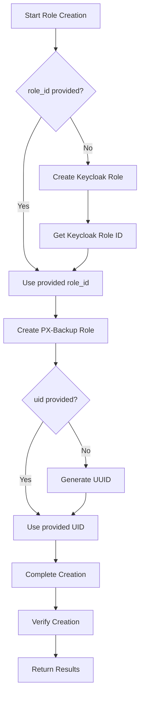

# PX-Backup Role Creation with Keycloak Integration

This document explains the enhanced role creation functionality that automatically integrates PX-Backup roles with Keycloak roles.

## Overview

When creating PX-Backup roles, you can now automatically create corresponding Keycloak roles and link them together. This provides seamless integration between PX-Backup's role-based access control and Keycloak's identity management.

## How It Works

1. **Automatic Keycloak Role Creation**: When creating a PX-Backup role without specifying a `role_id`, the system automatically creates a corresponding Keycloak role.

2. **Role Linking**: The newly created Keycloak role's ID is used as the `role_id` for the PX-Backup role, establishing the connection.

3. **Naming Convention**: Auto-created Keycloak roles follow the pattern: `px-backup-{role_name}`

4. **Metadata Tracking**: Keycloak roles include attributes that track their relationship to PX-Backup roles.

## Enhanced Features

### Automatic UID Generation
- If no `uid` is provided when creating a role, a UUID is automatically generated
- The generated UID is returned in the response for reference

### Keycloak Integration
- Automatic creation of Keycloak roles when `role_id` is not provided
- Seamless linking between PX-Backup and Keycloak roles
- Comprehensive error handling and verification

### Enhanced Validation
- Pre-creation checks for existing roles (optional)
- Post-creation verification
- Detailed reporting of creation results

## Usage Examples

### Basic Usage with Auto-Integration

```yaml
- name: Create role with automatic Keycloak integration
  role:
    operation: CREATE
    api_url: "{{ px_backup_api_url }}"
    token: "{{ px_backup_token }}"
    name: "backup-operator"
    org_id: "default"
    rules:
      - services: ['backup']
        apis: ['create*', 'inspect*', 'enumerate*']
    # No role_id specified - Keycloak role will be auto-created
```

### Using the Role Creation Playbook

```bash
# Use the role creation playbook with integrated Keycloak functionality
ansible-playbook examples/role/create.yaml -i inventory/hosts
```

### Manual Role ID Specification

```yaml
- name: Create role with existing Keycloak role
  role:
    operation: CREATE
    api_url: "{{ px_backup_api_url }}"
    token: "{{ px_backup_token }}"
    name: "backup-admin"
    org_id: "default"
    role_id: "existing-keycloak-role-id"  # Use existing Keycloak role
    rules:
      - services: ['backup']
        apis: ['*']
```

## Configuration Options

### Variables

| Variable | Default | Description |
|----------|---------|-------------|
| `auto_create_keycloak_roles` | `true` | Enable automatic Keycloak role creation |
| `check_existing_roles` | `true` | Check for existing roles before creation |
| `verify_creation` | `true` | Verify roles after creation |
| `fail_on_keycloak_error` | `false` | Fail entire process if Keycloak creation fails |

### Keycloak Role Attributes

Auto-created Keycloak roles include these attributes:
- `px_backup_role`: Name of the associated PX-Backup role
- `created_by`: "ansible-automation"
- `auto_generated`: "true"
- `creation_date`: ISO8601 timestamp

## Integration Workflow



## Error Handling

The role creation playbook includes comprehensive error handling:

1. **Validation Errors**: Pre-flight checks for required variables and role definitions
2. **Keycloak Errors**: Graceful handling of Keycloak role creation failures
3. **PX-Backup Errors**: Detailed error reporting for role creation issues
4. **Partial Failures**: Option to continue processing remaining roles on individual failures

## Output and Reporting

### Enhanced Output Data

The role creation playbook provides detailed output including:

```yaml
summary:
  total_roles_requested: 3
  px_backup_roles_created: 3
  px_backup_roles_failed: 0
  keycloak_roles_created: 2
  keycloak_roles_failed: 0
  roles_with_keycloak_integration: 2
  auto_generated_uids: ["uuid1", "uuid2", "uuid3"]
  keycloak_role_mappings:
    - px_backup_role: "backup-operator"
      keycloak_role_id: "keycloak-role-id-1"
    - px_backup_role: "restore-specialist"
      keycloak_role_id: "keycloak-role-id-2"
```

### Console Output

During execution, you'll see detailed progress information:

```
Keycloak Role Created:
=====================
PX-Backup Role: backup-operator
Keycloak Role Name: px-backup-backup-operator
Keycloak Role ID: 12345678-1234-5678-9abc-123456789012
Status: SUCCESS

PX-Backup Role Creation Results:
===============================
Role: backup-operator
Status: SUCCESS
Generated UID: 87654321-4321-8765-dcba-210987654321
Role ID Used: 12345678-1234-5678-9abc-123456789012
Keycloak Integration: YES
```

## Best Practices

1. **Use Descriptive Names**: Role names should clearly indicate their purpose
2. **Consistent Labeling**: Use consistent labels for better organization
3. **Minimal Permissions**: Follow the principle of least privilege
4. **Test Integration**: Verify both PX-Backup and Keycloak roles are created correctly
5. **Monitor Failures**: Check logs for any integration issues

## Troubleshooting

### Common Issues

1. **Keycloak Authentication Fails**
   - Verify `pxcentral_auth_url` is correct
   - Ensure token has sufficient permissions

2. **Role Already Exists**
   - Enable `check_existing_roles` to skip existing roles
   - Use unique role names

3. **Permission Denied**
   - Verify token has role creation permissions
   - Check organization ID is correct

### Debug Mode

Enable debug output for troubleshooting:

```yaml
- debug:
    var: keycloak_role_results
- debug:
    var: role_creation_results
```

## Migration from Basic Role Creation

To migrate existing role creation workflows:

1. The main `create.yaml` playbook now includes all enhanced functionality
2. Add Keycloak configuration variables to your `create.yaml` vars file
3. Set `auto_create_keycloak_roles: true` to enable integration
4. Test with a subset of roles first

## Security Considerations

- Keycloak roles are created with minimal default permissions
- Auto-generated roles include tracking attributes for audit purposes
- Role IDs establish secure links between systems
- All operations require valid authentication tokens
